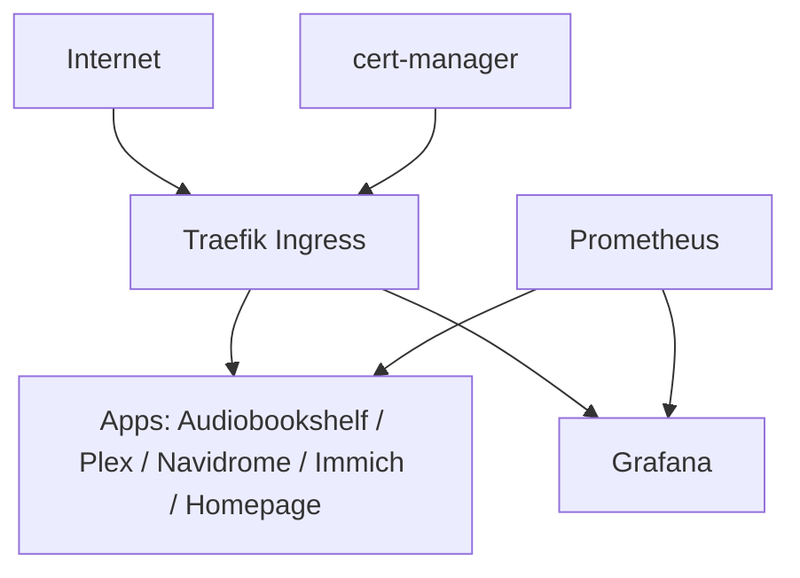

# pakube — K3s Homelab

A self-hosted Kubernetes cluster (K3s) built as a hands-on learning environment for 
DevOps and platform engineering — infrastructure, observability, and self-hosted 
applications, all managed as code.

## Background

I came into this from [17+ years in semiconductor equipment engineering — Nikon/ASML 
lithography systems at Intel — followed by some projects in medtech. 
This repo documents the cluster's evolution as I move toward infrastructure/DevOps work: 
what I built, what broke, and what I'd do differently at scale.

## Architecture

A diagram

- **Cluster**: K3s, 2 nodes bare metal repurposed laptops running Ubuntu server
- **Networking**: Traefik (LoadBalancer), Traefik (ingress)
- **TLS**: cert-manager + ClusterIssuer - Let's Encrypt / self-signed
- **Service CIDR**: 10.43.0.0/16

## Repo structure

| Folder | What's in it |
|---|---|
| [`infra/`](./infra) | Cluster plumbing — MetalLB, Traefik, cert-manager |
| [`monitoring/`](./monitoring) | Prometheus + Grafana observability stack |
| [`media/`](./media) | Self-hosted apps — Plex, Navidrome, Immich |
| [`homepage/`](./homepage) | Dashboard / landing page for the cluster |
| [`homeassistant/`(./homeassistant) | Work in progress when time permits |

Each folder has its own README covering what the app is, why it's there, and any 
gotchas hit while deploying it. (TO DO)

## How this evolved

Started with an old raspberry pi running pihole. Transtions to 2 pis clustered running technitium.
Had time and 2 old machines so deplyed k3s in order to regain some control of data in house.
Added home page intially and then worked through standard media apps with tls certification included.
Currently gaining some proficiency with the cluster and would consider researching devops roles.
## What's next / known gaps

- [ ] [No GitOps yet — everything applied manually via `helm install`/`kubectl apply`]
- [ ] [PV via nfs but work to be done for final cluster config and backup method]
- [ ] [2 node cluster with a view towards low power 3 node HA deplyment]
- [ ] [eventual home network overhaul with microtik]

## Contact

