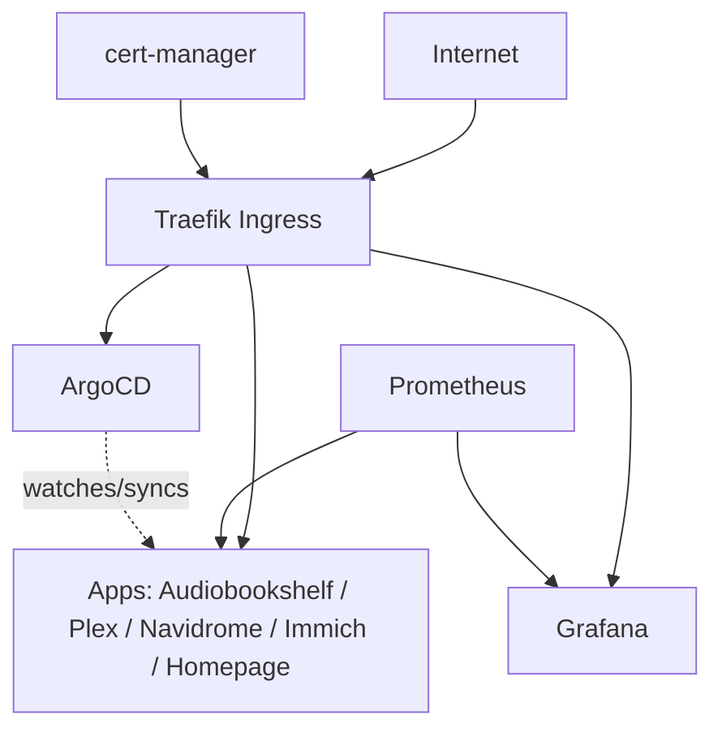

# pakube — K3s Homelab

A self-hosted Kubernetes cluster (K3s) built as a hands-on learning environment for
DevOps and platform engineering — infrastructure, observability, GitOps, and
self-hosted applications, all managed as code.

## Background

I came into this from 17+ years in semiconductor equipment engineering — Nikon/ASML
lithography systems at Intel — followed by some projects in medtech. This repo
documents the cluster's evolution as I move toward infrastructure/DevOps work: what
I built, what broke, and what I'd do differently at scale.

## Architecture

- **Cluster**: K3s, 2 nodes — bare metal, repurposed laptops running Ubuntu Server
- **Networking**: K3s built-in ServiceLB (Klipper) for LoadBalancer IPs, Traefik
  (K3s built-in addon) for ingress routing
- **TLS**: cert-manager + ClusterIssuer — Let's Encrypt (prod/staging split)
- **GitOps**: ArgoCD, Helm-installed, behind Traefik, LAN-only by design given its
  cluster-admin-level access
- **Service CIDR**: 10.43.0.0/16 · **Pod CIDR**: 10.42.0.0/16 (K3s defaults)

## Repo structure

| Folder | What's in it |
|---|---|
| [`infra/`](./infra) | Cluster plumbing — cert-manager, Traefik, ArgoCD |
| [`monitoring/`](./monitoring) | Prometheus + Grafana observability stack |
| [`media/`](./media) | Self-hosted apps — Plex, Navidrome, Audiobookshelf, Immich |
| [`homepage/`](./homepage) | Dashboard / landing page for the cluster |
| [`homeassistant/`](./homeassistant) | Work in progress when time permits |

Each folder has its own README covering what the app is, why it's there, and any
gotchas hit while deploying it. *(Several are still being backfilled — in progress.)*

## GitOps status

ArgoCD manages: `homepage`, `plex`, `navidrome`, `audiobookshelf`. Everything else
(`immich`, monitoring, infra components) is still deployed via plain
`helm install`/`upgrade` — conversion is ongoing, infra last given it carries the
highest blast radius if a bad sync ever took out ingress or cert-manager.

Sync policy is deliberately manual for every app right now (`prune: false`,
`selfHeal: false`) — I wanted to trust the pattern with real changes before letting
anything apply automatically.

Considered the "app of apps" pattern (ArgoCD managing its own config and even the
underlying infra components recursively). Deliberately not adopting it at this
scale — it solves a team-coordination problem I don't have, and it would add a
layer of indirection that made this week's actual debugging harder, not easier.

**Worth reading if you want the real story, not just the outcome:** `homepage` was
the first app converted, and its first real sync caused a live outage — a stale,
manually-maintained rendered-manifest snapshot silently diverged from a working
manual fix, and ArgoCD correctly reverted to the (wrong) snapshot the moment it
synced. Root-caused, fixed properly (converted to a multi-source Application
rendering live from the chart + values file, snapshot deleted), and it's the reason
every app converted since has been checked the same careful way — confirm the real
chart source, confirm the values file actually has everything currently live,
review the diff before syncing. Full writeup: [`infra/argocd/README.md`](./infra/argocd)

## How this evolved

Started with an old Raspberry Pi running Pi-hole. Transitioned to two Pis clustered
running Technitium for DNS. Had time and two old machines lying around, so deployed
K3s to regain some control over data staying in-house rather than on third-party
services. Added Homepage first, then worked through the standard self-hosted media
apps with proper TLS. Currently building GitOps proficiency (ArgoCD) on top of the
existing stack, and seriously considering DevOps/platform engineering roles as a
result of how much of this has stuck.

## What's next / known gaps

- [x] ~~No GitOps~~ — ArgoCD in place, 4 of ~8 apps converted; rest ongoing
- [ ] PV via NFS works for media; final backup strategy and full cluster
      persistence story still to be finalized
- [ ] 2-node cluster; considering a low-power 3-node HA setup down the line
- [ ] Eventual home network overhaul (Mikrotik)
- [ ] Per-app READMEs still being backfilled for the apps converted this week
- [ ] Sync policy is manual everywhere — revisit `selfHeal`/`prune` once more
      apps have proven stable under GitOps
`
